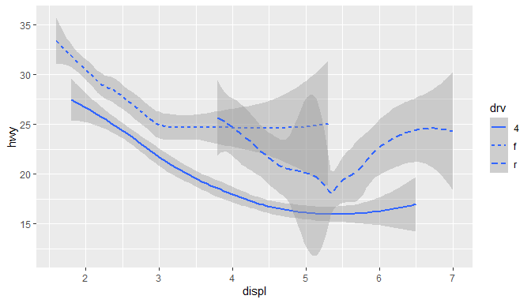
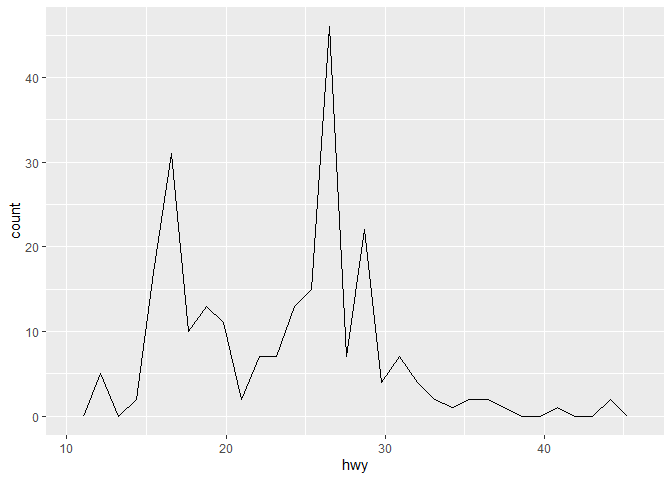
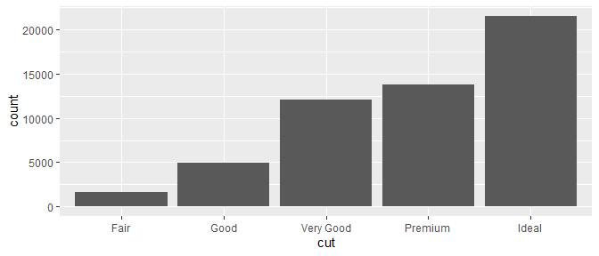
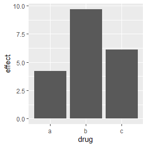

# Overview

This document will give you a short introduction to the wonderful world of ggplot2. Before you fight your way through this document, take a look at some of the [best visualisations](https://cedricscherer.netlify.com/2019/12/30/best-tidytuesday-2019/) from 2019 produced with ggplot. Just think of the struggle to produce those in base R.  
Here, we will deal with the basics and the most important aspects of the package. Each constituent of a graphic is explained shortly and a few examples will hopefully demonstrate how to use the learned input.  
You can find all exercises, solutions, and source code for this introduction in my [github repository](https://github.com/Ischi94/ggplot_intro).   
Please note that ggplot might be a gateway drug to the tidyverse. Unfortunately, this is neither an introduction to the tidyverse nor an exhaustive report showing you every detail of ggplots. If needed, I can provide an intro to the tidyverse within the next weeks. Ggplot offers the chance to produce *any* graph you can think of. Use your power wisely.


# Further literature  
  
While working on a specific plot, it's always a good idea to have the [cheatsheet](https://rstudio.com/wp-content/uploads/2015/03/ggplot2-cheatsheet.pdf) for ggplot2 open.  
It might be that my intro confused you more than it helped. This is definitely my fault and not due to ggplot2 beeing confusing. Don't let my bad presentation skills stop you from producing awesome graphs and do your own research instead.  
There are a number of free (and great!) books online covering ggplot2 and data visualisation in detail. [R for Data Science](https://r4ds.had.co.nz/) teaches you how to get your data into R, get it into the most useful structure, transform it, visualise it and model it. Read the chapters *Data Visualisation* and *Graphics for communication* for ggplot2 info. If you've mastered the basics of ggplot2 and want to learn more, read [ggplot2: Elegant Graphics for Data Analysis](https://ggplot2-book.org/index.html). It describes the theoretical underpinnings of ggplot2 and shows you how all the pieces fit together. This book helps you understand the theory that underpins ggplot2, and will help you create new types of graphics specifically tailored to your needs. If you still want more, read [Data Visualization: A practical introduction](http://socviz.co/). It introduces you to both the ideas and the methods of data visualization in a sensible, comprehensible, reproducible way using ggplot2 (with code). And last but not least, if you'd like to learn more about the theoretical underpinnings of ggplot2 before you start, you can always refer to [The Layered Grammar of Graphics](http://vita.had.co.nz/papers/layered-grammar.pdf).  
ggplot2 has a number of [extentions](http://exts.ggplot2.tidyverse.org/gallery/) (other packages), which we will ignore for now. Especially *ggrepel*, *ggforce* and *patchwork* might be very useful for you later on.  
The best thing about R compared to other programming languages is the community and the help you can find online by simply googling stuff. ggplot2 is no exception from this. You will find a lot of input online. 
  
  
# Get started
  
As ggplot2 is not part of base R, we need to download it first.

```r
install.packages("ggplot2")
library(ggplot2)
```
However, we will use data sets from the tidyverse. ggplot2 is a part of the tidyverse and will automatically get called along with other packages when you load the tidyverse. 

```r
library(tidyverse)
```

```
## -- Attaching packages --------------------------------------------------- tidyverse 1.3.0 --
```

```
## v ggplot2 3.3.2     v purrr   0.3.4
## v tibble  3.0.1     v dplyr   1.0.0
## v tidyr   1.1.0     v stringr 1.4.0
## v readr   1.3.1     v forcats 0.5.0
```

```
## -- Conflicts ------------------------------------------------------ tidyverse_conflicts() --
## x dplyr::filter() masks stats::filter()
## x dplyr::lag()    masks stats::lag()
```


## Data  
  
We will use three data sets which come with the ggplot2 package.    
The *mpg* data contains fuel economy data from 1999 to 2008 for 38 popular models of cars.   

Table: The mpg data set

|manufacturer |model | displ| year| cyl|trans      |drv | cty| hwy|fl |class   |
|:------------|:-----|-----:|----:|---:|:----------|:---|---:|---:|:--|:-------|
|audi         |a4    |   1.8| 1999|   4|auto(l5)   |f   |  18|  29|p  |compact |
|audi         |a4    |   1.8| 1999|   4|manual(m5) |f   |  21|  29|p  |compact |
|audi         |a4    |   2.0| 2008|   4|manual(m6) |f   |  20|  31|p  |compact |
  
Another popular dataset is the *economics* data. This dataset was produced from US economic time series data including unemployment rate. 

Table: The economics data set

|date       |   pce|    pop| psavert| uempmed| unemploy|
|:----------|-----:|------:|-------:|-------:|--------:|
|1967-07-01 | 506.7| 198712|    12.6|     4.5|     2944|
|1967-08-01 | 509.8| 198911|    12.6|     4.7|     2945|
|1967-09-01 | 515.6| 199113|    11.9|     4.6|     2958|
  
And we will have a few exercises on the prominent diamonds data set. A dataset containing the prices and other attributes of almost 54,000 diamonds.

Table: The diamonds data set

| carat|cut     |color |clarity | depth| table| price|    x|    y|    z|
|-----:|:-------|:-----|:-------|-----:|-----:|-----:|----:|----:|----:|
|  0.23|Ideal   |E     |SI2     |  61.5|    55|   326| 3.95| 3.98| 2.43|
|  0.21|Premium |E     |SI1     |  59.8|    61|   326| 3.89| 3.84| 2.31|
|  0.23|Good    |E     |VS1     |  56.9|    65|   327| 4.05| 4.07| 2.31|
    
     
    
## Our first ggplot
  
Equipped with these datasets, we want to answer some very basic questions using plots. Let's use our first graph to answer a question: Do cars with big engines use more fuel than cars with small engines? You probably already have an answer, but try to make your answer precise. What does the relationship between engine size and fuel efficiency look like? Is it positive? Negative? Linear? Nonlinear?  
  
We want to plot *mpg*, with **displ** (engine displacement, in litres) on the x-axis and **hwy** (highway miles per gallon) on the y-axis. Every plot starts with `ggplot()`.

```r
ggplot(data = mpg)
```
  
We need to add a geom to this call to map our data points. As we want to have a scatterplot, we need geom_point. We will discuss this soon, so don't worry. We can combine our `ggplot()` call with our specified geom with a **+** sign. Within the geom function, we can specify what should be plotted on the x-axis and what on the y-axis using the `aes()` specification. Aes stands for aestethics. Again, we will cover this soon.

```r
ggplot(data = mpg) +
  geom_point(mapping = aes(x = displ, y = hwy))
```


  
Our first ggplot! Now we can start to answer our question. Does this plot confirm or refute your hypothesis about fuel efficiency and engine size?
  
***  

Before we move on from here, let us quickly evaluate what we did here:  
We started our plot with the function `ggplot()`. `ggplot()` creates a coordinate system to which you can add layers to. The first argument of `ggplot()` is the dataset to use in the graph. So `ggplot(data = mpg)` creates an empty graph.
  
To showcase our data, we need to add one or more layers to `ggplot()`. We did this by using `geom_point()`, which creates a scatterplot. ggplot2 comes with many geom function which each add a different type of layer to a plot.  
  
Each geom function in ggplot2 takes a mapping argument. This defines how variables in your dataset are mapped to visual properties. The mapping argument is always paired with `aes()`, and the x and y arguments of `aes()` specify which variables to map to the x and y axes. ggplot2 looks for the mapped variables in the data argument, in this case, mpg.  
  
In other words, we told ggplot to open an empty plot with mpg as underlying data set, and then we added points by using a geom and specified x and y using the aesthetics mapping argument.  

***
  
  
# Aesthetic mappings  
  
In our plot, one group of points seems to fall outside of the linear trend. These cars have a higher mileage than you might expect. How can you explain these cars?  
  
Let's hypothesize that the cars are hybrids. One way to test this hypothesis is to look at the class value for each car. The `class` variable of the *mpg* dataset classifies cars into groups such as compact, midsize, and SUV. If the outlying points are hybrids, they should be classified as compact cars or, perhaps, subcompact cars.

You can add a third variable, like class, to a two dimensional scatterplot by mapping it to an aesthetic. An aesthetic is a visual property of the objects in your plot. Aesthetics include things like the size, the shape, or the color of your points. You can display a point in different ways by changing the values of its aesthetic properties.  
You can convey information about your data by mapping the aesthetics in your plot to the variables in your dataset. For example, you can map the colors of your points to the class variable to reveal the class of each car.

```r
ggplot(data = mpg) + 
  geom_point(mapping = aes(x = displ, y = hwy, colour = class))
```


  
Never disappoint Nussaibah and type *color* instead of the nice british *colour*. The good thing about ggplot2 however is that it will still understand you, even if you use ~~barbarous~~ american english.  
  
To map an aesthetic to a variable, associate the name of the aesthetic to the name of the variable inside `aes()`. ggplot2 will automatically assign a unique level of the aesthetic (here a unique colour) to each unique value of the variable, a process known as scaling. ggplot2 will also add a legend that explains which levels correspond to which values.  
  
Once you map an aesthetic, ggplot2 takes care of the rest. It selects a reasonable scale to use with the aesthetic, and it constructs a legend that explains the mapping between levels and values. For x and y aesthetics, ggplot2 does not create a legend, but it creates an axis line with tick marks and a label. The axis line acts as a legend; it explains the mapping between locations and values. These pre-specified graphics are normally very nice, but we will later see how you can precisely tailor those for your own needs. 

You can also set the aesthetic properties of your geom manually. For example, we can make all of the points in our plot green:

```r
ggplot(data = mpg) + 
  geom_point(mapping = aes(x = displ, y = hwy), colour = "darkgreen")
```


  
Here, the colour doesn't convey information about a variable, but only changes the appearance of the plot. To set an aesthetic manually, set the aesthetic by name as an argument of your geom function; i.e. it goes outside of `aes()`. You can use aesthetics for colour, shape, and size.

***  
  
Stop here and do the aesthetics exercises int the file *exercises_1.R*.  
  
***
  
  
# Facetting
  
  
Another technique for displaying additional categorical variables on a plot is facetting. Facetting creates tables of graphics by splitting the data into subsets and displaying the same graph for each subset.  
  
There are two types of facetting: grid and wrapped. Wrapped is the most useful, so we'll discuss it here, and you can learn about grid facetting later. To facet a plot you simply add a facetting specification with `facet_wrap()`, which takes the name of a variable preceded by `~`.

```r
ggplot(mpg, aes(displ, hwy)) +
  geom_point() +
  facet_wrap( ~ class)
```


  
  
Facetting is an alternative to using aesthetics (like colour, shape or size) to differentiate groups. Both techniques have strengths and weaknesses, based around the relative positions of the subsets. With facetting, each group is quite far apart in its own panel, and there is no overlap between the groups. This is good if the groups overlap a lot, but it does make small differences harder to see. When using aesthetics to differentiate groups, the groups are close together and may overlap, but small differences are easier to see.


***  
  
Stop here and do the facetting exercises.  
  
***
  
  
  
# Geometries
  
  
Instead of using `geom_point` for a scatterplot, we can use other geometries to produce a different type of plot. That's a great guess! This isn't an exhaustive list, but should cover the most commonly used plot types.  
  
* `geom_smooth()` fits a smoother to the data and displays the smooth and its standard error.  
  
* `geom_boxplot()` produces a box-and-whisker plot to summarise the distribution of a set of points.  
  
* `geom_histogram()` and `geom_freqpoly()` show the distribution of continuous variables.  
  
* `geom_bar()` shows the distribution of categorical variables.  
  
* `geom_path()` and `geom_line()` draw lines between the data points. A line plot is constrained to produce lines that travel from left to right, while paths can go in any direction. Lines are typically used to explore how things change over time.  
  
  
  
## Trend lines  
  
  
Every geom function in ggplot2 takes a mapping argument. However, not every aesthetic works with every geom. You could set the shape of a point, but you couldn't set the *shape* of a line. On the other hand, you could set the linetype of a line. `geom_smooth()` will draw a different line, with a different linetype, for each unique value of the variable that you map to linetype.  

```r
ggplot(data = mpg) +
  geom_smooth(mapping = aes(x = displ, y = hwy, linetype = drv))
```


  
  
`geom_smooth()` produces a smooth curve, including an assessment of uncertainty in the form of point-wise confidence intervals shown in grey. If you're not interested in the confidence interval, turn it off with `geom_smooth(se = FALSE)`. 

```r
ggplot(data = mpg) + 
  geom_smooth(mapping = aes(x = displ, y = hwy, linetype = drv), se = FALSE)
```


  
  
Here `geom_smooth()` separates the cars into three lines based on their *drv* value, which describes a car's drivetrain. One line describes all of the points with a 4 value, one line describes all of the points with an f value, and one line describes all of the points with an r value. Here, 4 stands for four-wheel drive, f for front-wheel drive, and r for rear-wheel drive.

If this sounds strange, we can make it more clear by overlaying the lines on top of the raw data and then coloring everything according to *drv*.

  
  

Notice that this plot contains two geoms in the same graph! To display multiple geoms in the same plot, add multiple geom functions to ggplot():  

```r
ggplot(data = mpg) + 
  geom_point(mapping = aes(x = displ, y = hwy)) +
  geom_smooth(mapping = aes(x = displ, y = hwy))
```


  
  
This, however, introduces some duplication in our code. Imagine if you wanted to change the y-axis to display cty instead of hwy. You'd need to change the variable in two places, and you might forget to update one. You can avoid this type of repetition by passing a set of mappings to `ggplot()`. ggplot2 will treat these mappings as global mappings that apply to each geom in the graph. In other words, this code will produce the same plot as the previous code:

```r
ggplot(data = mpg, mapping = aes(x = displ, y = hwy)) + 
  geom_point() + 
  geom_smooth()
```
  
  
If you place mappings in a geom function, ggplot2 will treat them as local mappings for the layer. It will use these mappings to extend or overwrite the global mappings for that layer only. This makes it possible to display different aesthetics in different layers.

```r
ggplot(data = mpg, mapping = aes(x = displ, y = hwy)) + 
  geom_point(mapping = aes(color = class)) + 
  geom_smooth()
```


  
  
  
  
## Boxplots and jittered points  
  
  
When a set of data includes a categorical variable and one or more continuous variables, you will probably be interested to know how the values of the continuous variables vary with the levels of the categorical variable. Say we're interested in seeing how fuel economy varies within cars that have the same kind of drivetrain. We might start with a scatterplot like this:

```r
ggplot(mpg, aes(drv, hwy)) + 
  geom_point()
```


  
  
Because there are few unique values of both drv and hwy, there is a lot of overplotting. Many points are plotted in the same location, and it's difficult to see the distribution. There are three useful techniques that help alleviate the problem:

* Jittering, `geom_jitter()`, adds a little random noise to the data which can help avoid overplotting.  
  
* Boxplots, `geom_boxplot()`, summarise the shape of the distribution with a handful of summary statistics.  
  
* Violin plots, `geom_violin()`, show a compact representation of the "density" of the distribution, highlighting the areas where more points are found.  
  
  

```r
ggplot(mpg, aes(drv, hwy)) + geom_jitter()
ggplot(mpg, aes(drv, hwy)) + geom_boxplot()
ggplot(mpg, aes(drv, hwy)) + geom_violin()
```


  
  
## Histograms and frequency polygons  
  
  
Histograms and frequency polygons show the distribution of a single numeric variable. They provide more information about the distribution of a single group than boxplots do, at the expense of needing more space.  

```r
ggplot(mpg, aes(hwy)) + geom_histogram()
```

```
## `stat_bin()` using `bins = 30`. Pick better value with `binwidth`.
```

```r
ggplot(mpg, aes(hwy)) + geom_freqpoly()
```

```
## `stat_bin()` using `bins = 30`. Pick better value with `binwidth`.
```


  
  
Both histograms and frequency polygons work in the same way: they bin the data, then count the number of observations in each bin. The only difference is the display: histograms use bars and frequency polygons use lines.

You can control the width of the bins with the *binwidth* argument (if you don't want evenly spaced bins you can use the breaks argument). It is very important to experiment with the bin width. The default just splits your data into 30 bins, which is unlikely to be the best choice. You should always try many bin widths, and you may find you need multiple bin widths to tell the full story of your data.


```r
ggplot(mpg, aes(hwy)) + 
  geom_histogram(binwidth = 2.5)
ggplot(mpg, aes(hwy)) + 
  geom_histogram(binwidth = 1)
```


  
  
  
## Bar charts  
  
  
The discrete analogue of the histogram is the bar chart, `geom_bar()`. It's easy to use:

```r
ggplot(diamonds, aes(cut)) + 
  geom_bar()
```


  
  
Note that we plotted `counts` on the y axis, but it is not included in the data set we fed into ggplot. `geom_bar` goes through your data and counts by itself.
  
  
Bar charts can be confusing because there are two rather different plots that are both commonly called bar charts. The above form expects you to have unsummarised data, and each observation contributes one unit to the height of each bar. The other form of bar chart is used for presummarised data. For example, you might have three drugs with their average effect:

```r
drugs <- tribble(
  ~drug, ~effect, 
#---- --|-----------
  "a",     4.2,
  "b",     9.7, 
  "c",     6.1
)
```
  
  
To display this pre-summarised data we need to use `geom_col` instead of `geom_bar`: 

```r
ggplot(drugs) +
  geom_col(aes(drug, effect))
```


  
  
  
This reveals a strange but awesome behaviour of ggplot2: Some geoms plot the raw data, like `geom_col` does, while other geoms go through your data and calculate their own input:

* bar charts, histograms, and frequency polygons bin your data and then plot bin counts, the number of points that fall in each bin.  
  
* smoothers fit a model to your data and then plot predictions from the model.  
  
boxplots compute a robust summary of the distribution and then display a specially formatted box.  
  
The algorithm used to calculate new values for a graph is called a **stat**, short for statistical transformation. The figure below describes how this process works with `geom_bar()`.  
  
  
 
  
  
You can learn which stat a geom uses by inspecting the default value for the *stat* argument. For example, `?geom_bar` shows that the default value for stat is *count*, which means that `geom_bar()` uses `stat_count()`. `stat_count()` is documented on the same page as `geom_bar()`, and if you scroll down you can find a section called *Computed variables*. That describes how it computes two new variables: count and prop.

You can generally use geoms and stats interchangeably. For example, you can recreate our previous plot using `stat_count()` instead of `geom_bar()`. 


```r
ggplot(diamonds, aes(cut)) + 
  stat_count()
```


  
  
  
This works because every geom has a default stat; and every stat has a default geom. This means that you can typically use geoms without worrying about the underlying statistical transformation. There are three reasons you might need to use a stat explicitly:

1. You might want to override the default stat. This would allow us to use `geom_bar` to plot our pre-summarised drug data: 

```r
ggplot(drugs) +
  geom_bar(aes(drug, effect), stat = "identity")
```


2. You might want to override the default mapping from transformed variables to aesthetics. For example, you might want to display a bar chart of proportion, rather than count:


```r
ggplot(data = diamonds) + 
  geom_bar(mapping = aes(x = cut, y = stat(prop), group = 1))
```


  
To find the variables computed by the stat, look for the help section titled "computed variables".  
  
  
3. You might want to draw greater attention to the statistical transformation in your code. For example, you might use `stat_summary()`, which summarises the y values for each unique x value, to draw attention to the summary that you're computing:

```r
ggplot(data = diamonds) + 
  stat_summary(mapping = aes(x = cut, y = depth),
               fun.min = min,
               fun.max = max,
               fun = median)
```


  
  
  
## Time series with lines  
  
  
Line and path plots are typically used for time series data. Line plots join the points from left to right, while path plots join them in the order that they appear in the dataset (in other words, a line plot is a path plot of the data sorted by x value). Line plots usually have time on the x-axis, showing how a single variable has changed over time. Path plots show how two variables have simultaneously changed over time, with time encoded in the way that observations are connected.

Because the year variable in the mpg dataset only has two values, we'll show some time series plots using the economics dataset, which contains economic data on the US measured over the last 40 years.


```r
ggplot(economics, aes(x = date, y = uempmed)) + 
  geom_line() 
```


  
  
  
We end the first part of our ggplot2 webinar here and continue with part 2 next week. So far, we've learned how to **call a ggplot** with `ggplot()` and add various **geoms** to it. We've learned how to map data to **aesthetics** to answer a few basic questions. An alternative approach to mapping aesthetics was **facetting**. We looked a bit under the hood of ggplot when we examined the **statistics** of each geom. Equipped with these tools, we can now produce a lot of different and complex plots.  
In the next part, we will try to make these plots visually pleasing. You will learn to modify the look of a ggplot so that it fits your needs. In the end, you will be able to produce publication ready plots within R. Additionally, we will learn how to safe those plots. 

  
  
  

  


